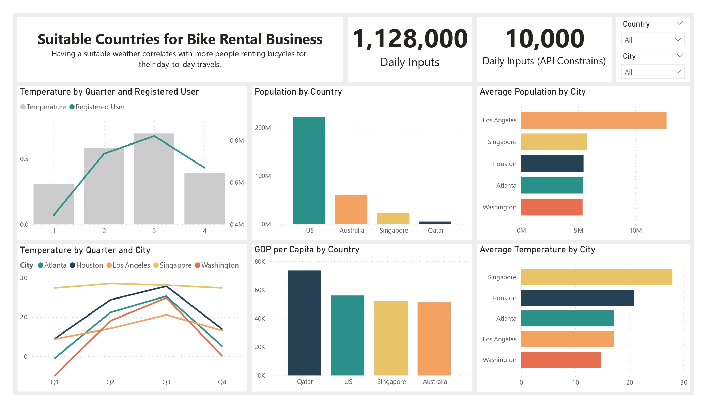
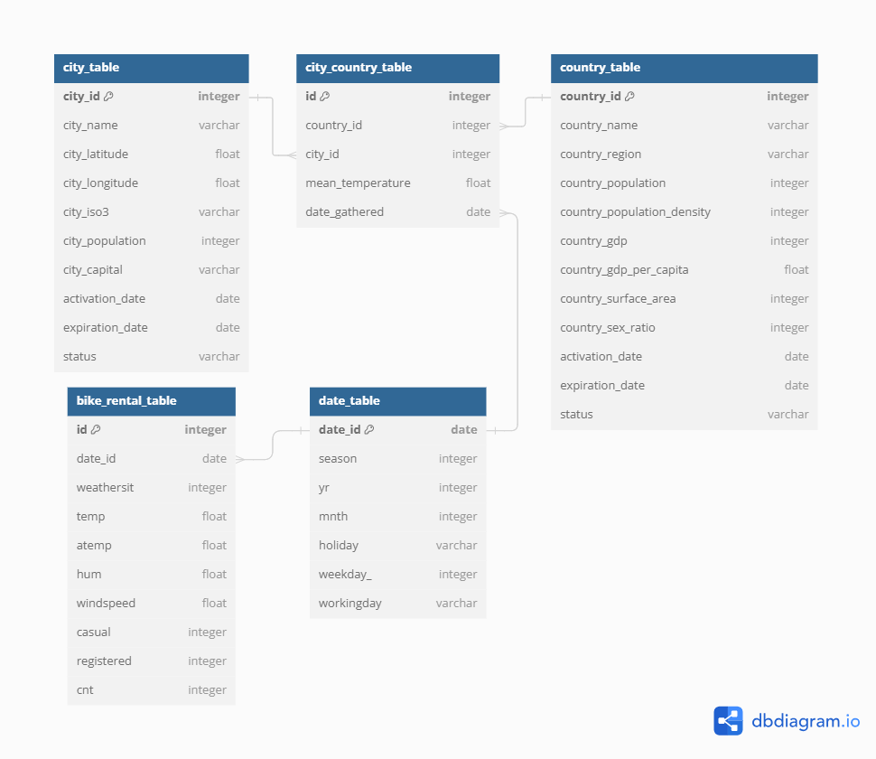
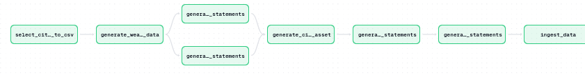

# 🚴‍♂️ Bike Rental Data Pipeline with Weather Data ☁️



## Project Overview

This project focuses on collecting and integrating bike rental data with weather data from an API. The solution is built using Docker, Dagster, PostgreSQL, and Python, following Kimball’s star schema and Slowly Changing Dimensions (SCD). The pipeline is designed to run hourly, generating over 1 million data points daily.

## Tech Stack

- **Docker:** Containerizes the entire application, with services running independently.
- **Dagster:** Automates and orchestrates the pipeline to run hourly.
- **PostgreSQL:** Stores both historical rental data and real-time weather data.
- **Python:** Handles data extraction, transformation, and loading (ETL).



## Data Pipeline

1. **Extract:** Gather latitude and longitude for cities worldwide, then fetch weather data using an API.
2. **Transform:** Create and automate SQL `INSERT` statements for PostgreSQL.
3. **Load:** Insert both historical and real-time data into PostgreSQL.
4. **Orchestrate:** Run all services in Docker containers, managed by Dagster.



## Getting Started

### Prerequisites

- **Docker** and **Python 3.8+** should be installed on your machine.

### Installation

1. **Clone the repository:**  
   ```bash
   git clone https://github.com/extrm-gn/DE-Bike-rental.git
   cd DE-Bike-rental
   docker-compose up --build

